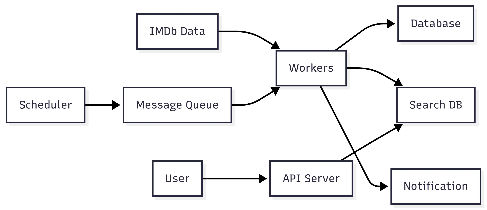

# imdb-search

영상 콘텐츠의 데이터와 사용자 평점을 제공하는 IMDb의 공개 데이터를 활용한 검색 시스템

## 프로젝트 목표

- IMDb 공개 데이터셋을 기반으로 영화/TV 콘텐츠를 검색 및 조회할 수 있는 시스템을 구축한다.
- 주기적으로 갱신되는 데이터를 기반으로 기준 데이터베이스와 검색 인덱스를 유지한다.

## 프로젝트 구조

## 주요 기능

## 이슈와 해결 과정
