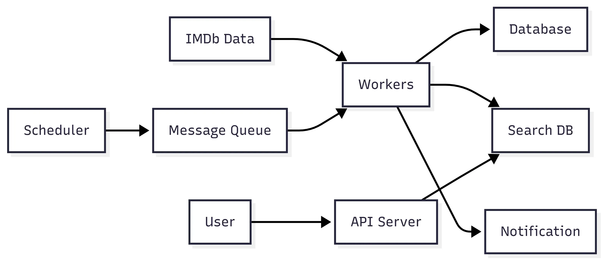
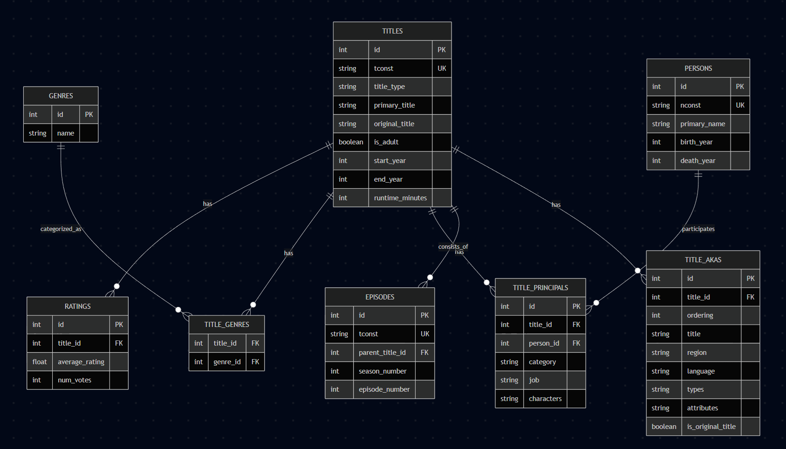

# imdb-search

영상 콘텐츠의 데이터와 사용자 평점을 제공하는 IMDb의 공개 데이터를 활용한 검색 시스템

## 프로젝트 구조도



## ERD



## 프로젝트 목표

- IMDb 공개 데이터셋을 기반으로 영화/TV 콘텐츠를 검색 및 조회할 수 있는 시스템을 구축하는 것이 목표입니다.
- 단순한 기능 구현뿐 아니라 약 1,200만 건의 대용량 데이터를 효율적으로 처리하고 색인하는 것이 목표입니다.
- MySQL과 OpenSearch를 역할에 맞게 분리하여 정형 데이터 조회와 전문 검색을 각각 최적화하는 것이 목표입니다.
- Redis 기반 태스크 큐를 직접 구현하여 데이터 수집 파이프라인의 동시성과 안정성을 확보하는 것이 목표입니다.

## 문제 해결 과정

- [워커 아키텍처 설계 결정](docs/decision-worker-architecture.md)
- [FK 제약 조건과 병렬 처리 동시성 이슈](docs/issue-fk-concurrency.md)
- [외부 데이터 오류 처리](docs/issue-data-errors.md)
- [2단계 파이프라인 설계 (Phase 1/2)](docs/decision-phase-pipeline.md)
- [데이터 입력 속도 및 메모리 이슈](docs/issue-input-speed.md)
- [삽입 속도 개선: LOAD DATA LOCAL INFILE + Staging 테이블](docs/decision-insertion-optimization.md)
- [성능 벤치마크](docs/perf-insertion-benchmark.md)

## 사용법

```bash
# 의존성 설치 후 빌드
npm install && npm run build

# 전역 커맨드 등록
npm link
```

| 커맨드                           | 설명                              |
| -------------------------------- | --------------------------------- |
| `imdbs run`                      | 파이프라인 + 색인 전체 실행       |
| `imdbs pipeline`                 | 데이터 수집 파이프라인 실행       |
| `imdbs pipeline --skip-download` | 다운로드 생략하고 파이프라인 실행 |
| `imdbs pipeline --skip-load-tsv` | DB 로드 생략하고 파이프라인 실행 |
| `imdbs pipeline --skip-normalization` | 정규화 생략하고 파이프라인 실행 |
| `imdbs index`                    | OpenSearch 색인 실행              |
| `imdbs api`                      | API 서버 시작                     |
| `imdbs cron`                     | 크론 데몬 시작 (매일 새벽 2시)    |

## 프로젝트 구현사항

- IMDb 공개 데이터셋 7종 다운로드 및 스트리밍 파싱 (`.tsv.gz`)
- `LOAD DATA LOCAL INFILE` + staging 테이블 방식으로 MySQL 삽입 최적화 (3~4시간 → ~2시간)
- 정규화 완료 후 FK 위반 행 직접 검증 (`LEFT JOIN` 기반 무결성 체크)
- MySQL 스키마 설계 및 FK 의존성을 고려한 2단계 삽입 순서 제어
- Redis 기반 producer-consumer 태스크 큐 직접 구현 및 백프레셔 적용
- 태스크 실패 시 재시도(`maxRetry`) 및 `TASKS` 테이블에 실패 상태 기록
- 파일 해시 체크로 변경 없는 데이터셋 재처리 생략
- cursor 기반 페이지네이션 + 태스크 큐 병렬화로 OpenSearch 인덱싱 최적화 (3~4시간 → ~14분)
- OpenSearch 전문 검색 — 제목, 한국어 제목(nori), 출연진, 감독 대상 퍼지 매칭
- 검색 필터링 — 작품 유형, 장르, 연도, 평점, 성인 콘텐츠 여부
- 정렬 기준 — 관련도, 평점, 연도, 투표수
- REST API 3개 엔드포인트 구현 (`/search`, `/titles/:tconst`, `/persons/:nconst`)
- CLI 진입점 구현 (`imdbs`) — 파이프라인, 색인, API, 크론 통합 관리
- TypeScript strict 모드 (`noUncheckedIndexedAccess`, `exactOptionalPropertyTypes`)
- ESM 프로젝트 (`"type": "module"`, `module: nodenext`)
- Jest 기반 단위 테스트 및 통합 테스트 작성
