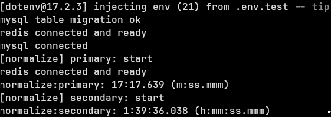
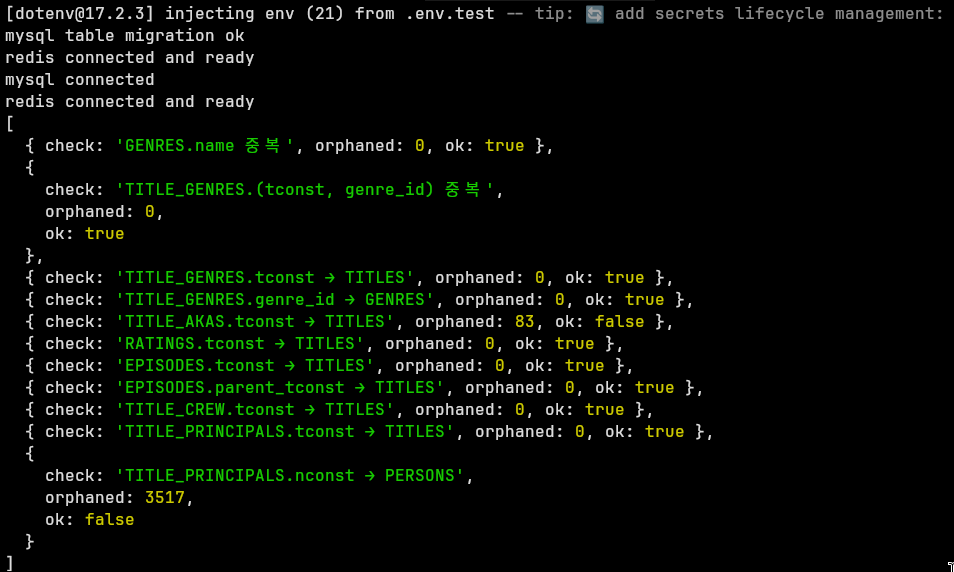

# 삽입 최적화: LOAD DATA LOCAL INFILE + Staging 테이블

## 문제

기존 파이프라인(`PARSE_PRIMARY` → `PARSE_SECONDARY` → `INSERT_DATA`)은 약 4~5시간 소요됐다.

병목 원인:

- **JS 파싱 오버헤드** — TSV를 라인 단위로 JS에서 파싱한 뒤 배치로 쌓아 INSERT
- **FK/인덱스 유지 비용** — 배치마다 FK 체크 + secondary index 업데이트 발생
- **genreLock 직렬화** — 장르 삽입이 단일 Promise 체인으로 묶여 멀티 워커여도 직렬 처리

---

## 해결

1. 각 TSV 데이터셋에 대응하는 staging 테이블을 추가한다. FK 없음, 인덱스 없음, 컬럼 타입 전부 VARCHAR.
2. `PARSE_PRIMARY` / `PARSE_SECONDARY` / `INSERT_DATA` 태스크 체인을 `LOAD_TSV` 단일 태스크로 대체한다.
3. `LOAD DATA LOCAL INFILE`로 staging에 로드한 뒤, `MysqlNormalize`에서 `INSERT INTO ... SELECT` SQL로 실제 테이블에 정규화한다.
4. 정규화 중 `SET FOREIGN_KEY_CHECKS=0`으로 FK 체크를 비활성화한다.

**결과:**

| 단계 | 소요시간 |
|------|---------|
| LOAD (7개 파일 병렬) | ~27초 |
| Normalize primary (genres, titles, persons → title_genres) | 17m 17s |
| Normalize secondary (akas, ratings, episodes, crew, principals 병렬) | 1h 39m 36s |
| **합계** | **~2시간** |

---

## 트레이드오프: FK 비활성화와 데이터 무결성

FK를 비활성화한 상태로 삽입하므로 고아 데이터가 존재할 수 있다. 정규화 완료 후 `LEFT JOIN`으로 FK 위반 행을 직접 검증했다.

| 체크 항목 | 결과 |
|---------|------|
| TITLE_AKAS.tconst → TITLES 고아 | 83 |
| TITLE_PRINCIPALS.nconst → PERSONS 고아 | 3,517 |
| 나머지 7개 항목 | 0 |

AKAS 83건, PRINCIPALS 3,517건은 IMDb 원본 데이터의 불일치로 판단했다. FK를 활성화한 상태였어도 해당 행은 INSERT 시 에러로 버려졌을 행이다.

---

## 이전 방식 대비 개선점

기존 배치 INSERT 방식은 배치 단위 실패 시 재시도 오버헤드가 발생하거나 해당 배치를 유실해야 했다. LOAD INFILE + staging 방식은 파일 단위로 로드하므로 실패 지점이 명확하고 재시도가 단순하다.
