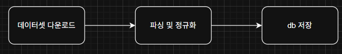

# 워커 아키텍처 설계 결정

## 문제



데이터셋 다운로드 → 파싱 및 정규화 → DB 저장으로 이어지는 일련의 처리 과정에서 구현 방식을 선택해야 했다.

1. 각 단계는 이전 단계의 결과물에 의존하기 때문에 파이프라인으로 구성하여 처리하는 것이 합당해 보인다.
2. 그러면 워커 하나에서 해당 파이프라인을 순서대로 실행하는 방식이 된다.
3. 하지만 이 방식은 Node.js의 장점인 비동기 기반 프로그래밍을 살리지 못한다 — 각 단계가 완료될 때까지 다음 단계로 넘어가지 못하기 때문이다.

## 해결

각 작업(다운로드, 파싱, 정규화, 저장)을 독립적인 태스크로 정의하고 워커 큐에 넣는다. 워커는 큐에서 태스크를 꺼내 명세를 읽고 처리한 후, 결과에 따라 다음 태스크를 큐에 등록하거나 DB에 저장한다.

이렇게 하면 각 작업이 독립적으로 처리될 수 있어 워커 수를 늘리거나 작업을 추가하는 데 유연하다.

## 트레이드오프

위 작업들이 하나의 파일에 대한 처리인데, 태스크 단위로 쪼개다 보면 파일 단위 추적이 어려워진다는 문제가 생긴다.

이를 해결하기 위해 파일 단위의 태스크 명세를 MySQL `TASKS` 테이블에 별도로 저장하고, 워커가 처리 후 해당 명세를 업데이트하는 방식으로 큐에 들어가는 태스크와 분리했다.

## Consumer와 Handler 분리

Consumer가 태스크의 내용이나 상태에 상관없이 큐에서 꺼내 소비하는 역할만 담당하도록 설계했다. 태스크 처리 로직은 `TaskHandlerMap`으로 분리하여 Consumer는 `handlers[task.name]`을 호출하기만 한다.

```ts
// Consumer는 태스크 종류를 모름
const handler = this.handlers[task.name];
await handler(task);
```

새로운 태스크 타입이 추가되더라도 Consumer를 수정할 필요 없이 `TaskHandlerMap`에 핸들러만 등록하면 된다.
