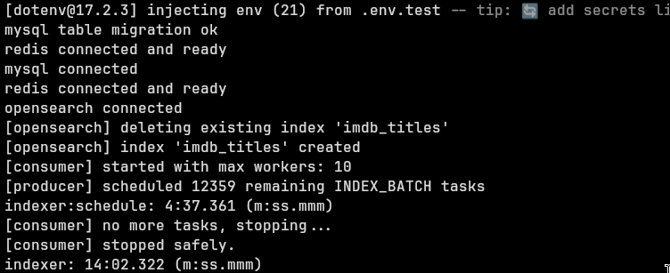

# 성능 벤치마크

## 환경
- MySQL 8, Redis, OpenSearch, Node.js (tsx)
- 워커 10개, 배치 사이즈 1,000

---

## MySQL 삽입

### 기존 방식 (JS parse → bulk INSERT)
- 총 소요시간: 3~4시간
- 방식: TSV 라인별 JS 파싱 → Redis 태스크 큐 → bulk INSERT (배치)
- 병목: FK/인덱스 유지 비용, genreLock 직렬화, JS 파싱 오버헤드

### 개선 후 (LOAD DATA LOCAL INFILE + staging)

**Load 단계 (7개 파일 병렬):**

| 파일 | 소요시간 |
|------|---------|
| name.basics.tsv | 5,694ms |
| title.basics.tsv | 9,110ms |
| title.akas.tsv | 10,890ms |
| title.principals.tsv | 19,954ms |
| title.ratings.tsv | 20,003ms |
| title.crew.tsv | 20,993ms |
| title.episode.tsv | 27,279ms |
| **전체 (병렬)** | **~27s** |

**Normalize 단계 (FK OFF):**

| 단계 | 소요시간 |
|------|---------|
| primary (genres, titles, persons → title_genres) | 17m 17s |
| secondary (akas, ratings, episodes, crew, principals 병렬) | 1h 39m 36s |
| **전체** | **~1h 57m** |

secondary 병목: `TITLE_PRINCIPALS` (9,834만행)

**비교:**

| 방식 | 합계 |
|------|------|
| 기존 (JS parse → bulk INSERT) | 3~4시간 |
| LOAD INFILE + FK OFF | ~2시간 |

---

## OpenSearch 인덱싱

### 기존 방식 (순차 루프 + OFFSET 페이지네이션)
- 총 소요시간: 7~8시간
- 방식: `LIMIT ? OFFSET ?` 순차 for-await 루프
- 병목: offset 증가에 따른 MySQL 풀스캔 비용, 병렬화 없음

### 개선 후 (cursor 기반 + 태스크 큐 병렬화)

| 항목 | 수치 |
|------|------|
| 총 INDEX_BATCH 태스크 | 12,359개 |
| 스케줄링 소요시간 | 4m 37s |
| 인덱싱 소요시간 | 14m 02s |

**비교:**

| 방식 | 합계 |
|------|------|
| 기존 (순차 루프 + OFFSET) | 3~4시간 |
| 태스크 큐 병렬화 | ~14분 |
